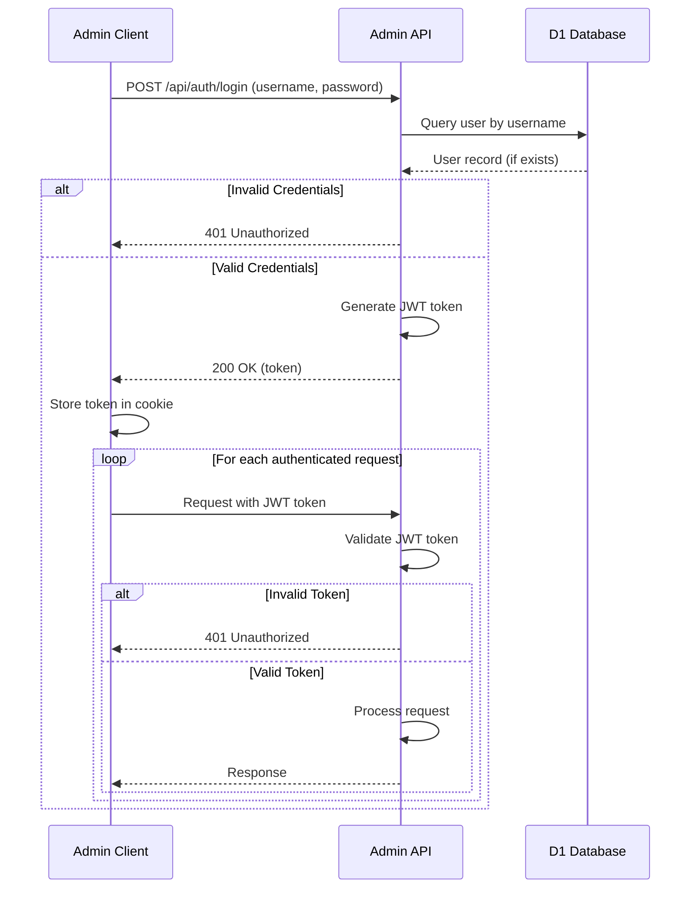

# Authentication Flow

This document describes the authentication flow for the Soundmaster admin dashboard, including the login process, token validation, and security considerations.

## Overview

The Soundmaster admin dashboard uses a JWT (JSON Web Token) based authentication system. This approach provides a stateless authentication mechanism that works well with serverless architectures.

## Authentication Flow Diagram



## Login Process

1. The admin user navigates to the login page (`/login.html`)
2. The user enters their username and password
3. The client sends a POST request to `/api/auth/login` with the credentials
4. The server validates the credentials against the database
5. If valid, the server generates a JWT token and returns it to the client
6. The client stores the token in a cookie named `adminToken`
7. The client redirects to the dashboard page

## Token Validation

For each authenticated request:

1. The client includes the JWT token in the request (via cookie)
2. The server extracts the token from the request
3. The server validates the token signature
4. The server checks if the token has expired
5. If valid, the server processes the request
6. If invalid, the server returns a 401 Unauthorized response

## JWT Token Structure

The JWT token has the following structure:

**Header:**
```json
{
  "alg": "HS256",
  "typ": "JWT"
}
```

**Payload:**
```json
{
  "sub": "admin",
  "role": "admin",
  "iat": 1620000000,
  "exp": 1620086400
}
```

Where:
- `sub`: Subject (username)
- `role`: User role (admin, editor)
- `iat`: Issued at timestamp
- `exp`: Expiration timestamp

## Security Considerations

### Token Storage

The JWT token is stored in a cookie with the following attributes:
- `HttpOnly`: Prevents JavaScript access to the cookie
- `Secure`: Only sent over HTTPS connections
- `SameSite=Strict`: Prevents cross-site request forgery (CSRF)

### Token Expiration

Tokens have a limited lifetime (24 hours by default) to minimize the impact of token theft.

### HTTPS

All communication between the client and server is encrypted using HTTPS.

### Password Storage

User passwords are stored as hashed values in the database, not as plaintext.

## Implementation Details

The authentication system is implemented in the `auth.ts` module with the following key functions:

- `login(username, password)`: Validates credentials and generates a JWT token
- `validateToken(token)`: Validates a JWT token and returns the user information
- `requireAuth(request)`: Middleware that ensures a request is authenticated

## Error Handling

The authentication system handles the following error cases:

- Invalid credentials: Returns 401 Unauthorized with message "Invalid username or password"
- Missing token: Returns 401 Unauthorized with message "Authentication required"
- Invalid token: Returns 401 Unauthorized with message "Invalid token"
- Expired token: Returns 401 Unauthorized with message "Token expired"
