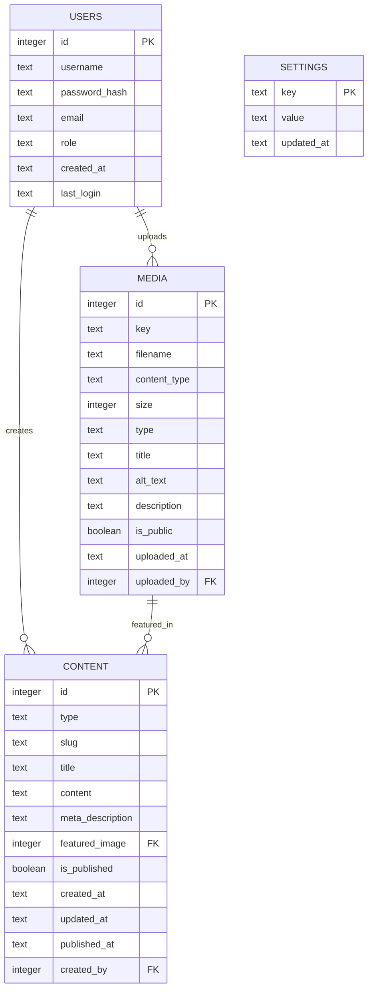

# Database Schema

This document describes the database schema for the Soundmaster website, including tables, relationships, and data types.

## Overview

The Soundmaster website uses Cloudflare D1, a serverless SQL database, to store all application data. The schema is designed to support content management, user authentication, and media library functionality.

## Schema Diagram

## Tables

### Users

The `users` table stores information about admin users who can access the admin dashboard.

| Column | Type | Description |
|--------|------|-------------|
| id | INTEGER | Primary key, auto-incremented |
| username | TEXT | Unique username for login |
| password_hash | TEXT | Hashed password for authentication |
| email | TEXT | User's email address (optional) |
| role | TEXT | User's role (admin, editor) |
| created_at | TEXT | Timestamp of user creation |
| last_login | TEXT | Timestamp of last login |

### Media

The `media` table stores metadata about media files uploaded to the system. The actual files are stored in Cloudflare R2.

| Column | Type | Description |
|--------|------|-------------|
| id | INTEGER | Primary key, auto-incremented |
| key | TEXT | Unique key for the file in R2 storage |
| filename | TEXT | Original filename |
| content_type | TEXT | MIME type of the file |
| size | INTEGER | File size in bytes |
| type | TEXT | Media type (image, audio, video, document) |
| title | TEXT | Display title for the media (optional) |
| alt_text | TEXT | Alternative text for accessibility (optional) |
| description | TEXT | Description of the media (optional) |
| is_public | BOOLEAN | Whether the media is publicly accessible |
| uploaded_at | TEXT | Timestamp of upload |
| uploaded_by | INTEGER | Foreign key to users table |

### Content

The `content` table stores all content items for the website, including news articles, team members, schedules, and playlists.

| Column | Type | Description |
|--------|------|-------------|
| id | INTEGER | Primary key, auto-incremented |
| type | TEXT | Content type (news, team, schedule, playlist) |
| slug | TEXT | URL-friendly identifier |
| title | TEXT | Content title |
| content | TEXT | Content body (HTML) |
| meta_description | TEXT | Meta description for SEO (optional) |
| featured_image | INTEGER | Foreign key to media table (optional) |
| is_published | BOOLEAN | Whether the content is published |
| created_at | TEXT | Timestamp of creation |
| updated_at | TEXT | Timestamp of last update |
| published_at | TEXT | Timestamp of publication |
| created_by | INTEGER | Foreign key to users table (optional) |

### Settings

The `settings` table stores global settings for the website.

| Column | Type | Description |
|--------|------|-------------|
| key | TEXT | Primary key, setting identifier |
| value | TEXT | Setting value |
| updated_at | TEXT | Timestamp of last update |

## Indexes

The following indexes are created to improve query performance:

- `users_username_idx`: Index on `username` column in `users` table
- `media_key_idx`: Index on `key` column in `media` table
- `content_type_slug_idx`: Compound index on `type` and `slug` columns in `content` table

## Constraints

The following constraints are enforced to maintain data integrity:

- `users_username_unique`: Unique constraint on `username` column in `users` table
- `media_key_unique`: Unique constraint on `key` column in `media` table
- `content_type_slug_unique`: Unique constraint on combination of `type` and `slug` columns in `content` table

## Relationships

- A user can upload multiple media files (one-to-many)
- A user can create multiple content items (one-to-many)
- A media item can be featured in multiple content items (one-to-many)

## Initialization

The database is automatically initialized when the admin dashboard is first accessed. The initialization process:

1. Creates all tables if they don't exist
2. Inserts a default admin user
3. Inserts default settings
4. Inserts sample content for demonstration purposes
