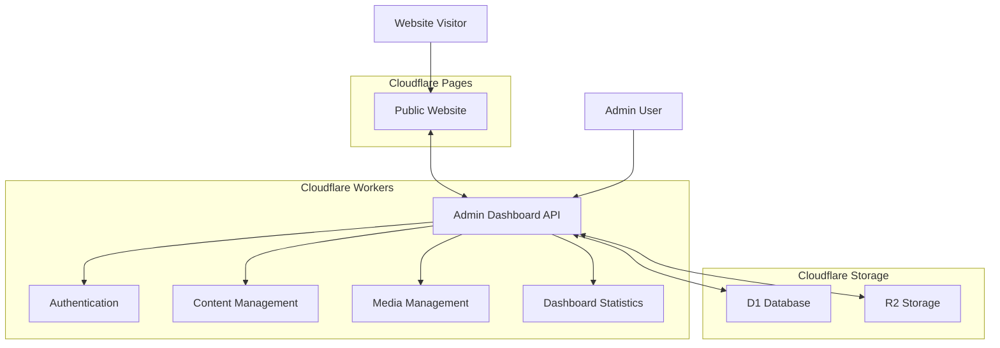

# System Architecture

This document describes the overall architecture of the Soundmaster website, including its components, services, and interactions.

## Overview

The Soundmaster website is built using Cloudflare's suite of services, following a serverless architecture pattern. The system consists of two main components:

1. **Admin Dashboard** - A Cloudflare Workers application for content management
2. **Public Website** - A static website hosted on Cloudflare Pages

## Architecture Diagram

## Components

### Admin Dashboard

The Admin Dashboard is a Cloudflare Workers application that provides the following functionality:

- **Authentication**: JWT-based authentication for admin users
- **Content Management**: API endpoints for managing content (news, team, schedules, playlists)
- **Media Management**: API endpoints for managing media files (images, audio, video)
- **Dashboard Statistics**: API endpoints for retrieving dashboard statistics

The Admin Dashboard is implemented using TypeScript and follows a modular architecture with separate modules for each functionality area.

### Public Website

The Public Website is a static website hosted on Cloudflare Pages that provides the following functionality:

- **Content Display**: Display content from the Admin Dashboard
- **Media Playback**: Play media files from the Admin Dashboard
- **Responsive Design**: Optimized for desktop and mobile devices

The Public Website is implemented using HTML, CSS, and JavaScript.

## Data Storage

### D1 Database

The D1 Database is a serverless SQL database provided by Cloudflare. It stores the following data:

- **Users**: Admin user accounts
- **Content**: Website content (news, team, schedules, playlists)
- **Media**: Metadata for media files
- **Settings**: Website settings

### R2 Storage

The R2 Storage is an object storage service provided by Cloudflare. It stores the following data:

- **Media Files**: Images, audio, and video files

## Authentication Flow

The Admin Dashboard uses JWT-based authentication with the following flow:

1. Admin user submits login credentials (username/password)
2. Admin Dashboard verifies credentials against the database
3. If valid, Admin Dashboard generates a JWT token and returns it to the client
4. Client stores the JWT token in a cookie
5. Client includes the JWT token in subsequent requests
6. Admin Dashboard verifies the JWT token for each request

## API Communication

The Public Website communicates with the Admin Dashboard through API endpoints:

1. Public Website sends API requests to the Admin Dashboard
2. Admin Dashboard processes the requests and returns responses
3. Public Website renders the content based on the responses

## Deployment

Both the Admin Dashboard and Public Website are deployed to Cloudflare using the following process:

1. Code is pushed to the repository
2. Deployment script is executed
3. Admin Dashboard is deployed to Cloudflare Workers
4. Public Website is deployed to Cloudflare Pages
5. Database schema is initialized if needed

## Security Considerations

The Soundmaster website implements the following security measures:

- **Authentication**: JWT-based authentication for admin users
- **CORS**: Cross-Origin Resource Sharing restrictions
- **HTTPS**: All communication is encrypted using HTTPS
- **Content Security Policy**: Restricts the sources of content that can be loaded
- **Input Validation**: All user input is validated before processing
