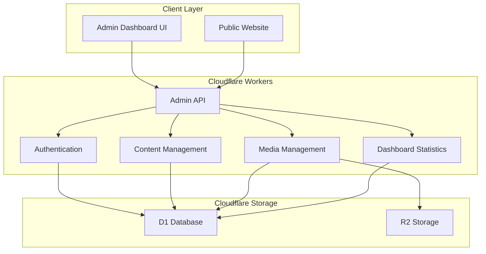
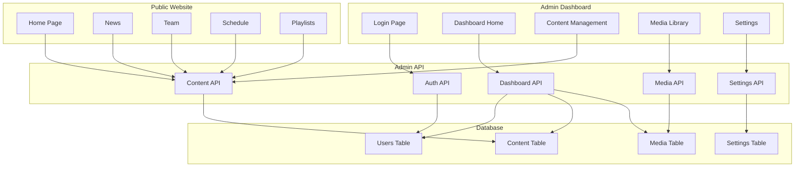
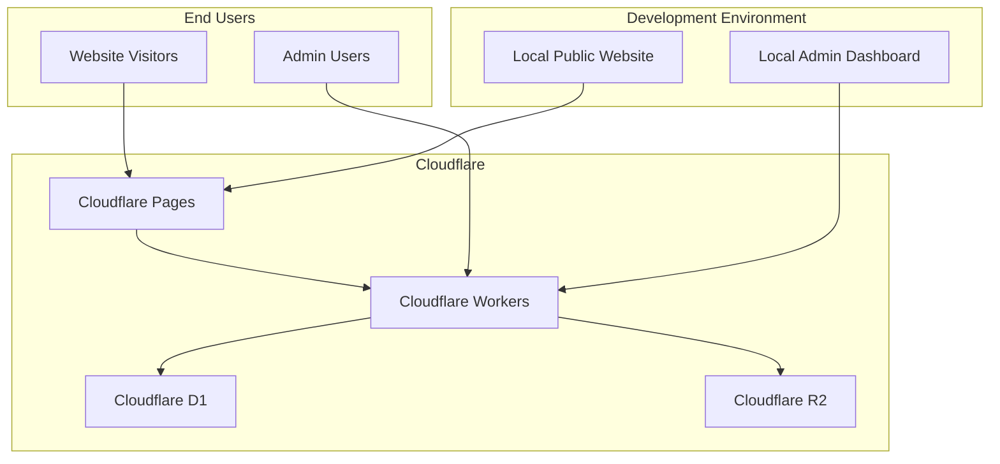
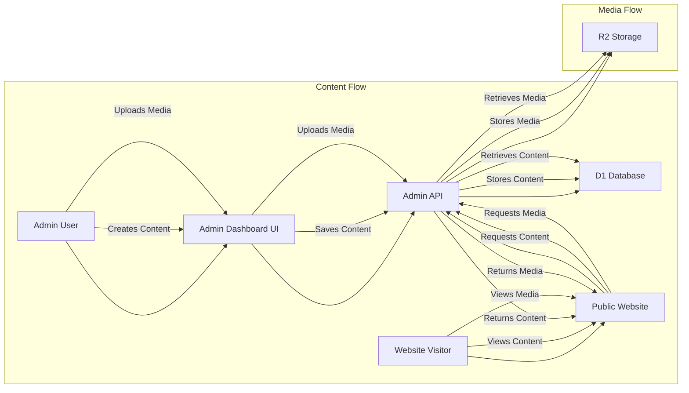
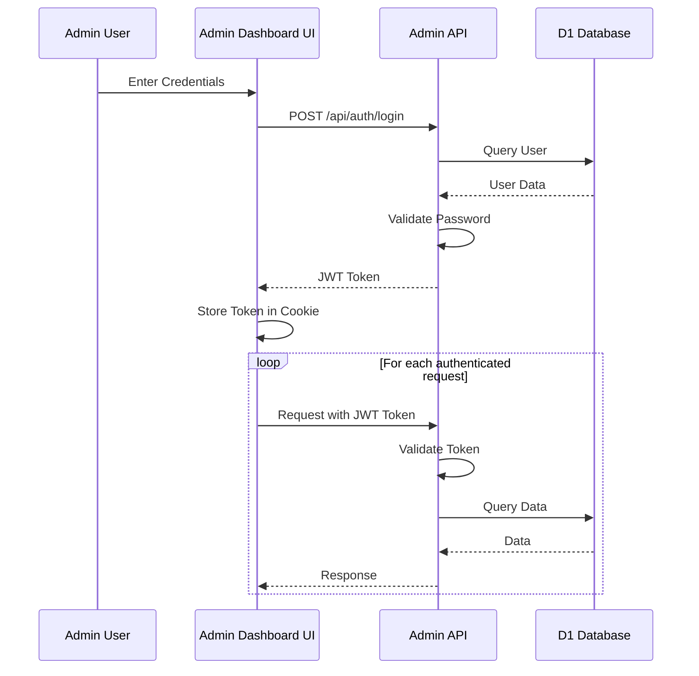
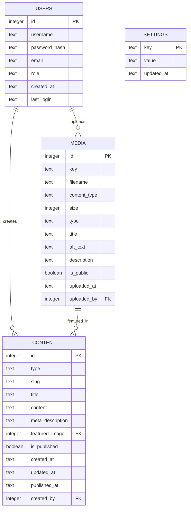

# System Architecture Diagram

This document provides visual representations of the Soundmaster website's system architecture.

## Overview Diagram

The following diagram shows the high-level architecture of the Soundmaster website, including the main components and their interactions.

## Component Diagram

The following diagram shows the detailed components of the Soundmaster website and their relationships.

## Deployment Architecture

The following diagram shows the deployment architecture of the Soundmaster website on Cloudflare.

## Data Flow Diagram

The following diagram shows the data flow within the Soundmaster website.

## Authentication Flow Diagram

The following diagram shows the authentication flow for the admin dashboard.

## Database Schema Diagram

The following diagram shows the database schema for the Soundmaster website.

